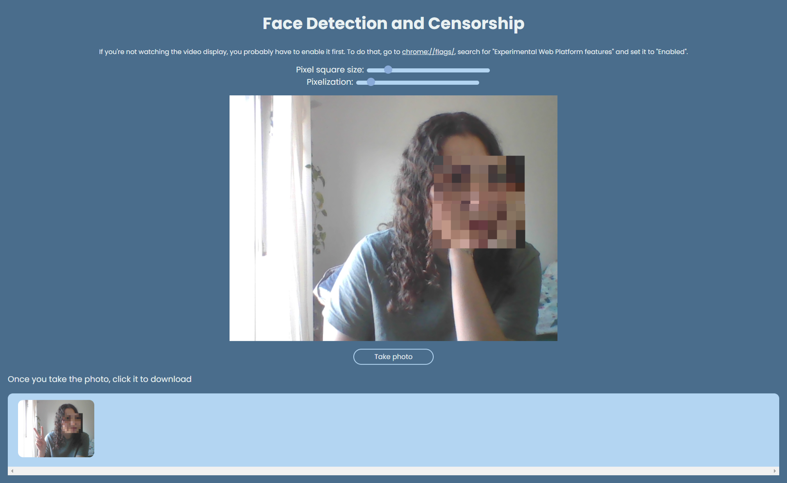

# Face Detection and Censorship - Project from Beginner JavaScript

This is a project for Wes Boss's 'Beginner JavaScript' course.
It's available in chrome browsers only.
If you can't see the video display, you probably have to enable it first. To do that, go to [chrome://flags/]chrome://flags/, search for "Experimental Web Platform features" and set it to "Enabled".

### Screenshot

### Links

- Live Site URL: [https://cl4ram.github.io/face-detection-and-cesonrship/](https://cl4ram.github.io/face-detection-and-cesonrship/)

## My process

- HTML Canvas Graphics
- Vanilla JS
- Parcel
- Face detection API

### Pending functionalities

- Add video recorder
